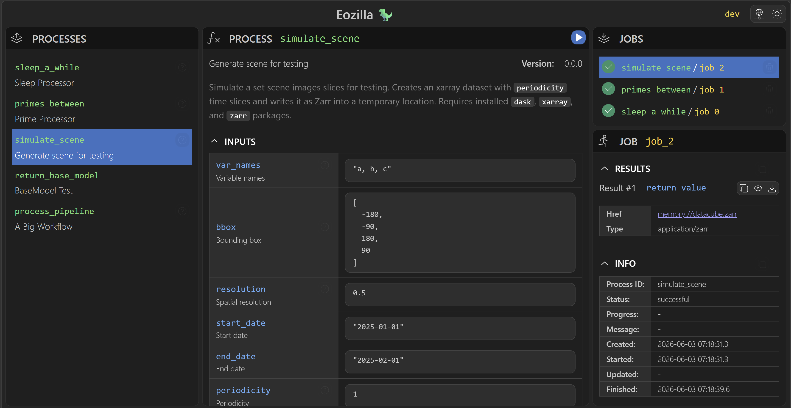

# Eozilla App

[](https://github.com/eo-tools/eozilla-app/actions/workflows/ci.yml)
[](LICENSE)
[](https://www.typescriptlang.org/)
[](https://vite.dev/)

Eozilla App is a Vite + React + TypeScript frontend for
[OGC API - Processes](https://github.com/opengeospatial/ogcapi-processes)
services.

It lets you connect to a _OGC API - Processes_ service, browse processes, inspect jobs,
and review inputs, outputs, and results in a split-panel interface.



## At A Glance

- Purpose: interact with OGC API - Processes services from a browser UI
- UI library: Mantine
- State management: Zustand
- Data flow: service registry and provider adapters in `src/service`
- Persistence: local app state in `src/state`
- Testing: Vitest

## What You Can Do

- Select and load a service provider
- Browse available processes
- Inspect process descriptions, inputs, and outputs
- View the job list and job details
- Open job results and error tracebacks
- Persist selected service and UI state locally

## Repository Map

```text
src/
  components/   UI building blocks, dialogs, and panels
  service/      OGC API - Processes models, providers, registry, and helpers
  state/        Persisted app state and related types
  store/        Zustand store, actions, and hooks
  utils/        General helpers, field utilities, and JSON/schema logic
  main.tsx      Application entry point
```

Useful entry points when exploring the code:

- `src/main.tsx` initializes providers, notifications, and the app root.
- `src/components/Main.tsx` defines the main split-panel layout.
- `src/service/index.ts` re-exports service-related modules.
- `src/store/store.ts` sets up application state.

## Getting Started

### Prerequisites

- Node.js and npm
- Optional: [Pixi](https://pixi.sh/) and a sibling checkout of
  `../eozilla` if you want to run the local Dev Service backend

### Install Dependencies

```bash
npm install
```

### Run The Frontend

```bash
npm run dev
```

### Run With The Local Dev Service

The `dev-server` script expects the `eozilla` backend repository next to this
project at `../eozilla`.

1. Clone the backend repository next to this one.
2. Install backend dependencies:

```bash
cd ../eozilla
pixi install
```

3. Start the backend service from this repository:

```bash
npm run dev-server
```

4. In a second terminal, start the frontend:

```bash
npm run dev
```

5. In the app, select the `Dev Service` provider.

## Useful Scripts

```bash
npm run dev         # Start the Vite dev server
npm run dev-server  # Start the local wraptile-backed service
npm run test        # Run the Vitest suite
npm run typecheck   # TypeScript type check without emitting files
npm run lint        # Run ESLint
npm run format      # Format source files with Prettier
npm run build       # Type-check and build production assets
npm run preview     # Preview the production build locally
```

## Working On The Codebase

- UI work usually belongs in `src/components`.
- Process and service integration work usually belongs in `src/service`.
- Shared app state and actions belong in `src/store`.
- Persisted app state belongs in `src/state`.
- Tests live next to the implementation as `*.test.ts` files.

## For LLMs

- Start with `src/components/Main.tsx` to understand the app layout.
- Read `src/service/*` before changing request/response models or provider
  behavior.
- Read `src/store/*` before changing cross-component state.
- Keep OGC API - Processes terminology intact:
  - A `Process` describes a capability exposed by the service.
  - A `Job` is an execution instance of a process.
- Prefer small, local changes over broad rewrites.
- If you change behavior, run `npm run typecheck`, `npm run lint`, and
  `npm run test` before finishing.

## License

MIT. See [LICENSE](LICENSE).
