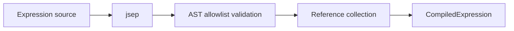

# Dynamic Expressions

This document describes the TypeScript/React module `components/dynamic-expression` 
in `eozilla-app`. It is intentionally written for future AI agents and maintainers
who need to continue the work without rediscovering its constraints.

The initial controlled-value implementation is complete. Path-selective value
subscriptions described below remain a planned optimization.

## Goal

Dynamic expressions allow UI metadata to derive values from the current
process-input object. The first use case is conditional visibility and
enablement in schema-generated forms:

```yaml
x-ui-visible: "advanced"
x-ui-hidden: "auth_type === 'anonymous'"
x-ui-enabled: "auth_type === 'login'"
x-ui-disabled: "auth_type !== 'login'"
```

The expression engine itself is not limited to booleans. It evaluates to JSON-
compatible values so it can support future computed UI metadata without a
second parser or runtime.

The design is built around a few core ideas:

- parse expressions with `jsep`, never `eval()` or `Function`
- validate the parsed AST against a deliberately small language
- compile each distinct expression once and collect its value dependencies
- evaluate against a well-defined root-relative value scope
- keep boolean-condition semantics as a strict adapter over the generic engine
- avoid any reactive runtime for schemas that contain no dynamic expressions
- subscribe only to referenced values when a selector-capable value source is
  available

## Non-Goals

Dynamic expressions are not intended to provide:

- general JavaScript execution
- statements, assignments, loops, functions, or object construction
- schema validation or conditional requiredness
- mutation of form values
- references to the visibility or enablement state of other fields
- server-side security or authorization rules

UI state does not replace JSON Schema validation. Conditional validation and
requiredness belong in schema constructs such as `if`/`then`/`else` where
supported by the producer and validator.

## Main Package Layout

The new package should live beside `schema-form`:

```text
src/components/dynamic-expressions/
  DynamicExpressionProvider.tsx
  collectExpressionReferences.ts
  compileExpression.ts
  context.ts
  dynamicExpressions.test.ts
  evaluateExpression.ts
  hooks.ts
  types.ts
  index.ts
```

Tests should be colocated with the corresponding modules. Files may be merged
when an abstraction is too small to justify its own module, but parsing,
validation, evaluation, and React integration must remain conceptually
separate.

The public package name is `dynamic-expressions`. The shorter names `dyn-cond`
and `cond-expr` are intentionally avoided because the engine is generic and the
abbreviations obscure its purpose.

## Result Model

Expression results are restricted to the values the form can already hold:

```ts
type ExpressionValue = JsonValue | undefined;
```

`undefined` represents a missing reference. Functions, symbols, dates, class
instances, and other arbitrary JavaScript values are never valid expression
values.

The generic API evaluates any supported value:

```ts
function evaluateExpression(
  expression: CompiledExpression,
  scope: ExpressionScope,
): ExpressionValue;
```

Boolean UI conditions use a strict adapter:

```ts
function evaluateConditionExpression(
  expression: CompiledExpression,
  scope: ExpressionScope,
): boolean;
```

The adapter must reject non-boolean results. It must not apply JavaScript
truthiness. For example, `x-ui-visible: "auth_type"` is an error when
`auth_type` is a string, rather than treating every non-empty authentication
type as visible.

This distinction catches schema-authoring mistakes while preserving a generic
expression engine for future uses such as numeric limits or generated text.

## Schema Metadata

The initial integration recognizes these properties:

```ts
type UiConditionExpression = boolean | string;

interface XUi {
  visible?: UiConditionExpression;
  hidden?: UiConditionExpression;
  enabled?: UiConditionExpression;
  disabled?: UiConditionExpression;
}
```

Booleans remain static metadata. Strings are expression source text. This keeps
existing `x-ui-hidden: true` schemas compatible.

The effective state is:

```ts
const visible =
  evaluateOptionalCondition(field.visible, true) &&
  !evaluateOptionalCondition(field.hidden, false);

const enabled =
  parentEnabled &&
  evaluateOptionalCondition(field.enabled, true) &&
  !evaluateOptionalCondition(field.disabled, false);
```

The negative form therefore wins when both positive and negative annotations
are present. Schema authors should normally use only one property from each
pair.

The first implementation only makes these four boolean properties dynamic.
The engine may return other value types, but future string-valued metadata
needs an explicit expression marker because an ordinary string could otherwise
be either a literal or expression source. That syntax is deliberately left for
a later design decision.

## Expression Language

The language looks like a small, expression-only subset of JavaScript.

Initially supported syntax:

- string, number, boolean, and `null` literals
- identifiers
- non-computed member access such as `provider.region`
- computed access with a literal key or index such as `items[0]`
- parentheses
- unary `!`
- `&&`, `||`, and `??`
- `===`, `!==`, `<`, `<=`, `>`, and `>=`
- the conditional operator `condition ? a : b`

Arithmetic can be added when the first non-boolean computed property requires
it. It should not be enabled speculatively.

Explicitly unsupported syntax includes:

- loose equality (`==` and `!=`)
- calls and method calls
- `this`
- assignments and update operators
- sequence and compound expressions
- arrays and objects constructed inside expressions
- template literals
- computed member access with a dynamic key
- optional chaining until its missing-value semantics are specified

Even if `jsep` can parse a construct, the AST validator must reject it unless
it is listed as supported here.

## Parser And Compilation

Use `jsep` as the parser. It is expression-only, has no runtime dependencies,
and produces an ESTree-like AST suitable for both dependency collection and a
small interpreter.

Parsing is only the first compilation step:



The compiled representation should contain at least:

```ts
interface CompiledExpression {
  source: string;
  ast: SupportedExpressionNode;
  references: readonly ExpressionReference[];
}
```

`SupportedExpressionNode` should be an application-owned discriminated union.
Do not let the evaluator accept `jsep.Expression` directly: its broad and
partly open typings make it too easy to accidentally interpret a new node type
without validation.

Compilation errors should preserve the source expression and parser position
where possible. Schema normalization may report them as diagnostics, but an
invalid expression must not crash the whole process-input panel.

## AST Safety

The evaluator walks the validated AST and never turns it back into executable
JavaScript.

Member access must reject these names at every level:

- `__proto__`
- `prototype`
- `constructor`

Only own data properties of JSON-compatible objects are readable. Missing
members return `undefined`. Prototype traversal and getters are outside the
value model and must not be invoked.

Evaluation must preserve short-circuit behavior for `&&`, `||`, `??`, and the
conditional operator. Dependency collection is conservative and collects
references from every branch, even when a branch is not evaluated in the
current snapshot. This trades a few possibly unnecessary subscriptions for a
stable dependency set that never changes as values change.

## Expression Scope

Every expression is evaluated relative to the field carrying the metadata.

Scope rules:

- a bare identifier resolves against the object containing the field
- `$root` is the complete form value
- `$value` is the current field value
- `$index` is the current array-item index when applicable

Example:

```yaml
type: object
properties:
  auth_type:
    type: string
  password:
    type: string
    x-ui-enabled: "auth_type === 'login'"
```

For `password`, `auth_type` resolves as a sibling property. An explicit
cross-tree reference can use `$root.account.region`.

Unknown identifiers and missing properties evaluate to `undefined`. They do
not fall through to browser globals or module scope.

### Value Paths Versus Render Paths

Expression lookup requires a root-relative `valuePath` that represents the
actual JSON value:

```ts
type ValuePath = readonly (string | number)[];
```

The existing schema-form `FieldRenderContext.path` must not be assumed to be a
value path. In particular, selective composition currently appends an option
index while the selected value itself does not contain that index.

Schema-form integration should therefore introduce an explicit `valuePath`:

- root field: `[]`
- object property: append the property name
- array item: append the item index
- `oneOf` or `anyOf` option: preserve the current value path
- nullable wrapper: preserve the current value path
- merged `allOf`: preserve the current value path

If the existing `path` remains useful for schema/render identity, keep it as a
separate concept with a more descriptive name.

## Reference Collection

Compilation walks the AST and emits scope-relative reference descriptors rather
than immediately resolving paths:

```ts
type ExpressionReference =
  | { base: "sibling"; path: readonly PathSegment[] }
  | { base: "root"; path: readonly PathSegment[] }
  | { base: "value"; path: readonly PathSegment[] }
  | { base: "index" };
```

The same compiled expression can then be reused at different field paths. For
example, `enabled && count > 0` can be parsed once and resolved independently
for every row of an object array.

References are deduplicated during compilation. Runtime path resolution is
memoized by compiled expression, field value path, and array index for as long
as that rendered field instance exists.

## React Integration

The package should expose generic and condition-specific hooks:

```ts
function useExpression(
  expression: CompiledExpression,
  scope: ExpressionScopeDescriptor,
): ExpressionValue;

function useConditionExpression(
  expression: CompiledExpression,
  scope: ExpressionScopeDescriptor,
): boolean;

function useConditionalUiState(
  metadata: CompiledUiExpressions,
  scope: ExpressionScopeDescriptor,
): {
  visible: boolean;
  disabled: boolean;
};
```

One `useConditionalUiState()` call should evaluate all expressions attached to
a field. Do not create four independent subscriptions for the four UI
properties.

A form with dynamic expressions provides its controlled root value once near
the root:

```tsx
<DynamicExpressionProvider value={value}>{children}</DynamicExpressionProvider>
```

In the current controlled-value implementation, consumers observe root-value
changes through React context. Static schemas never create this provider.

### Planned Value Source Abstraction

The optimized implementation should depend on a small value-source interface
rather than directly on Zustand or the process-request store:

```ts
interface ExpressionValueSource {
  getValue(path: ValuePath): ExpressionValue;

  subscribe(paths: readonly ValuePath[], listener: () => void): () => void;
}
```

An optimized hook can implement React's external-store contract with
`useSyncExternalStore`. A Zustand-backed adapter may use one selector over the
union of a field's referenced paths with shallow equality.

There must not be one store per expression or field. If an adapter needs a
form-local runtime, create at most one runtime per `SchemaForm` instance.

The process-request state remains canonical. A form-local runtime, if needed,
is a subscription/indexing adapter and must not become a second independently
mutable copy of process inputs.

## Schema-Form Integration

Dynamic expressions should be applied at a field boundary around the selected
factory. The boundary must encompass layout wrappers so an invisible field does
not leave an empty `Box`, grid cell, or array row behind.

Conceptually:

```tsx
<ConditionalFieldBoundary field={field} valuePath={valuePath}>
  <RenderedField />
</ConditionalFieldBoundary>
```

Hooks must live in React components. They must not be called directly from the
ordinary `DefaultSchemaFormGenerator.renderField()` method.

Enablement becomes part of the render context and propagates through container
fields:

```ts
interface FieldRenderContext {
  disabled: boolean;
  valuePath: ValuePath;
  // existing properties
}
```

Factories pass `disabled` to Mantine controls and combine it with their own
structural restrictions. Object and array disablement propagates to all child
controls. Custom widgets such as maps must explicitly honor disabled state; a
CSS `pointer-events` rule alone is not accessible or sufficient.

Static ordering and advanced-field filtering must be separated from dynamic
visibility. The current `getVisibleInputFields()` cannot treat a string-valued
`hidden` property as a static boolean.

## Performance Design

Large process schemas may produce hundreds or thousands of rendered fields.
The dynamic-expression feature must be close to free for static schemas and
proportional to the number of actual dynamic expressions for dynamic schemas.

### Schema-Level Fast Path

While the schema is normalized into a `Field` tree, compute dynamic-expression
metadata bottom-up:

```ts
interface FieldExpressionMetadata {
  ownExpressions?: CompiledUiExpressions;
  hasDynamicExpressions: boolean;
  dynamicExpressionCount: number;
}
```

For a leaf, `hasDynamicExpressions` means it owns at least one string-valued
dynamic property. For a container, it is true when the container or any
descendant has one.

The root flag is the primary fast path:

```tsx
if (!rootExpressionMetadata.hasDynamicExpressions) {
  return renderStaticSchemaForm();
}

return renderDynamicSchemaForm();
```

When the flag is false:

- do not create an expression provider or runtime
- do not create expression subscriptions
- do not render conditional boundary components
- do not run expression hooks
- keep the current static `hidden` behavior
- avoid even allocating empty expression metadata per rendered field

This check costs nothing beyond the schema-tree traversal that already occurs
in `getFieldFromSchema()`.

The same flag should exist per subtree. A dynamic root can still send a wholly
static object or array subtree through its existing rendering path without
per-field dynamic wrappers.

### Compile Once

Parsing, validation, and reference collection happen during schema/field
normalization, never during React rendering.

Cache compilation by exact expression source:

```ts
Map<string, CompiledExpression | ExpressionCompilationError>;
```

Caching failures prevents a malformed repeated expression from being reparsed
on every schema conversion. Because process schemas may come from remote
services, the cache must be bounded, for example with an LRU limit. A starting
limit of 512 distinct expressions is sufficient and should be configurable in
tests.

Schema-specific metadata should use `WeakMap` where practical so discarded
field trees and schemas can be garbage-collected.

### Subscribe To Dependencies, Not The Root

For selector-capable value sources, a field subscribes to the union of paths
referenced by all its expressions. An update to an unrelated input must not
reevaluate or rerender that conditional field.

Dependency snapshots compare values with `Object.is`. This relies on the form's
existing immutable replacement behavior. In-place mutation of JSON objects is
unsupported.

Do not rescan the full input object after each change and do not build a new
global dependency graph on each render. Reference paths are known from the
compiled AST and resolved once for a mounted field instance.

### Avoid Subscription Multiplication

For one field with several dynamic properties:

- merge and deduplicate all referenced paths
- create one external-store subscription
- obtain one dependency snapshot
- evaluate the relevant expressions from that snapshot

Hidden subtrees are unmounted and therefore hold no descendant subscriptions.
Only the expression controlling the subtree's visibility remains subscribed.

Array items share compiled ASTs. Each mounted item resolves its own relative
paths and owns at most one combined subscription, regardless of how many
conditions are attached to that item field.

### Stable React Identities

The following values must be stable across ordinary input changes:

- compiled expressions
- field metadata
- provider/source identity
- resolved dependency-path arrays for a mounted field
- callbacks returned by the value-source adapter

Avoid creating path arrays and selectors unconditionally inside hot render
loops. Memoize them at the conditional-field boundary using compiled metadata,
`valuePath`, and `$index` as inputs.

Dynamic state should not be copied into React component state. Its value is a
pure function of the current dependency snapshot.

### Controlled-Value Fallback

If the first integration cannot expose path-level subscriptions from the
process-request store, the provider may temporarily use the controlled root
`value` as its snapshot. This is correct but causes all dynamic consumers to
observe each root update.

Even in this fallback:

- static schemas still take the zero-runtime fast path
- only fields with expressions evaluate expressions
- ASTs and references remain compiled and stable
- the value-source abstraction must remain in place so path-selective
  subscriptions can be added without changing expression APIs

Do not introduce a mirrored Zustand store solely to claim selector-based
reactivity unless measurements show that it reduces total renders and its
synchronization semantics are well-defined.

## Error Handling

Expression errors should be distinguishable as:

- parse errors
- unsupported AST nodes or operators
- invalid references
- evaluation errors
- result-type errors

Malformed dynamic metadata should produce a developer-facing diagnostic and
fall back to the annotation's neutral value:

- invalid `visible`: `true`
- invalid `hidden`: `false`
- invalid `enabled`: `true`
- invalid `disabled`: `false`

This preserves the static UI instead of unexpectedly making fields disappear
or become unusable. Production rendering should not repeatedly log the same
compilation error; cache and deduplicate diagnostics by schema and expression.

## Value And Submission Semantics

Visibility and enablement are presentation state only:

- hiding a field does not delete or reset its value
- disabling a field does not delete or reset its value
- hidden and disabled values remain in the submitted process request
- changing a condition never invokes `onChange` by itself
- a hidden required field remains required according to its schema

Automatic clearing or omission would create feedback cycles and silently alter
requests. If a future use case requires conditional omission, it needs a
separate explicit feature and design.

## Test Strategy

### Parser And Validator Tests

Cover:

- every supported node and operator
- rejection of calls, `this`, compound expressions, and dynamic computed keys
- rejection of prototype-related member names
- complete input consumption
- useful source positions for syntax errors
- compilation-cache hits, cached errors, and eviction

### Evaluator Tests

Cover:

- literals and identifier lookup
- sibling, root, current-value, and array-index scopes
- nested object and literal array-index access
- missing values
- strict boolean result enforcement
- short-circuit semantics
- conditional expressions
- JSON-compatible result enforcement

### Reference Tests

Cover:

- collection from every branch of short-circuit and conditional expressions
- path deduplication
- root-relative and sibling-relative resolution
- repeated expressions at different object and array paths
- composition options preserving their value path

### React Tests

Cover:

- visible/hidden and enabled/disabled precedence
- parent disabled state propagation
- hidden fields leaving no layout wrapper
- hidden subtrees releasing descendant subscriptions
- array-item-relative conditions
- static boolean compatibility
- invalid-expression neutral fallbacks

### Performance Tests

Prefer deterministic counters over brittle wall-clock assertions.

At minimum, verify:

- a schema with no dynamic properties creates no provider/runtime and no
  expression subscriptions
- a static subtree beneath a dynamic root creates no per-field dynamic
  boundaries
- the same source string is parsed once across many fields
- one field with four conditions creates only one subscription
- changing an unrelated path does not reevaluate an expression when using a
  selector-capable source
- removing an array item removes its subscriptions
- hiding an object subtree removes all descendant subscriptions

Add a representative large fixture to the `schema2ui` playground, for example
1,000 fields with a controlled mixture of static and dynamic metadata. It is
useful for profiling and manual regression checks even when CI assertions use
instrumentation rather than timings.

Suggested performance acceptance criteria:

- static forms remain within measurement noise of the current renderer
- expression compilation never occurs during render
- unrelated input updates cause zero expression evaluations in optimized mode
- work for a relevant update is proportional to the affected expressions, not
  total field count

## Implementation Status And Next Steps

Completed:

1. Added `jsep` and the supported AST types, compiler, validator, evaluator,
   and reference collector.
2. Extended field normalization with compiled expression metadata and
   bottom-up `hasDynamicExpressions` flags.
3. Introduced root-relative `valuePath` semantics in schema-form, including
   arrays, nullable fields, and composition branches.
4. Added the static/dynamic root split and conditional field boundary.
5. Implemented strict visibility behavior without changing form values.
6. Propagated disabled state through built-in and custom field factories.
7. Added a `schema2ui` fixture and correctness/integration tests.

Remaining optimization work:

1. Add the value-source abstraction and dependency-selective subscriptions.
2. Add render/evaluation instrumentation and large-tree profiling coverage.

Each step should keep the raw JSON editor and JSON fallback paths operational.

## Decisions And Caveats

- The module is named `dynamic-expressions`, not after its first boolean use
  case.
- `jsep` parses expressions; application code owns validation and evaluation.
- Expression results are generic JSON-compatible values, but UI conditions are
  strictly boolean.
- Static booleans are not dynamic expressions and do not activate the runtime.
- Missing references produce `undefined`; they do not access globals.
- Dynamic visibility and enablement never mutate form data.
- Dependency sets are conservative and fixed after compilation.
- A selector-capable value source is preferred, but the expression package is
  not coupled to Zustand.
- The schema-level and subtree-level static fast paths are required, not an
  optional optimization.
