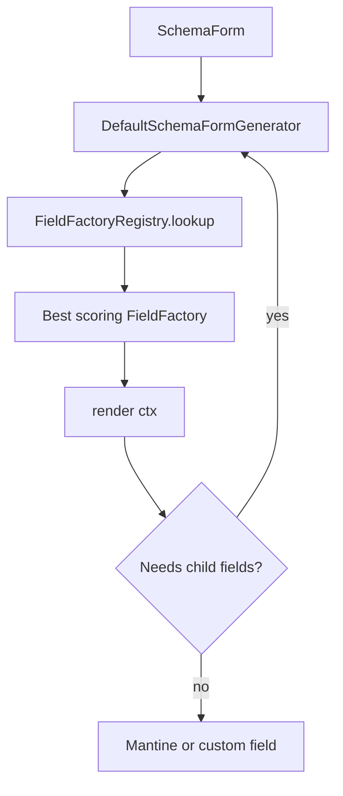
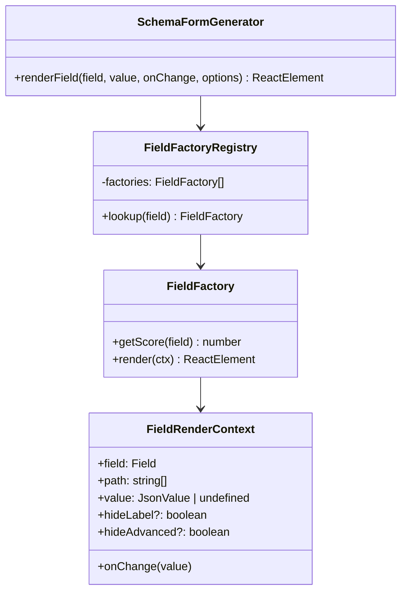
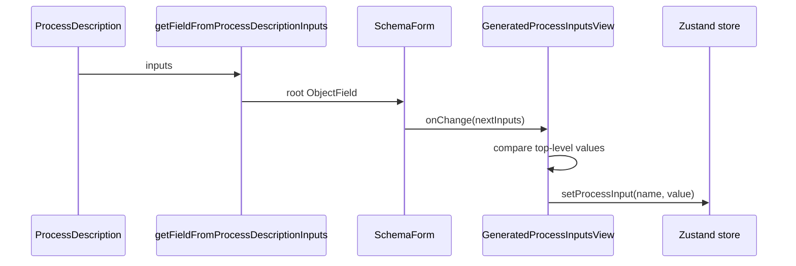

# Schema Form Generator

This document describes the TypeScript/React schema-form generator in
`eozilla-app`. It is intentionally written for future AI agents and maintainers
who need to continue the work without rediscovering the design.

## Goal

The schema-form generator turns OpenAPI/JSON-schema-derived process input
metadata into a controlled React form built from Mantine components.

The generator is built around a few core ideas:
- normalized `Field` metadata extracted from schemas
- a scored field factory registry
- a render context that can recursively render child fields
- a JSON fallback for unsupported or partially supported shapes

## User-Facing Integration

The process inputs panel supports two editor modes:

- `Form`: generated controls from `SchemaForm`
- `JSON`: unstyled and tabular, raw JSON input fields


- state type: `ProcessEditorMode`
- app state property: `processEditorMode`
- default: `"form"`
- action: `setProcessEditorMode()`
- hook: `useProcessEditorMode()`

Relevant files:

- `src/state/types.ts`
- `src/store/actions.ts`
- `src/store/hooks.ts`
- `src/components/panels/process/ProcessInputsSubPanel.tsx`
- `src/components/panels/process/GeneratedProcessInputsView.tsx`
- `src/components/panels/process/ProcessInputsView.tsx`

`ProcessInputsView.tsx` must remain a valid fallback path. The generated form is
an additional UI, not a replacement for raw JSON editing.

## Main Package Layout

```text
src/components/schema-form/
  ArrayField.tsx
  FieldShell.tsx
  JsonFallbackField.tsx
  MapField.tsx
  SchemaForm.tsx
  SelectiveCompositionField.tsx
  fieldUtils.ts
  generator.ts
  selectiveCompositionUtils.ts
  types.ts
  factories/
    array.tsx
    boolean.tsx
    composition.tsx
    defaultRegistry.ts
    enum.tsx
    integer.tsx
    jsonFallback.tsx
    nullable.tsx
    number.tsx
    object.tsx
    string.tsx
```

Supporting schema and value helpers live in:

```text
src/utils/field.ts
src/utils/json/
```

## Core Architecture

The public component is `SchemaForm`:

```tsx
<SchemaForm
  field={inputsField}
  value={processInputs}
  onChange={handleChange}
  hideLabel={hideLabel}
  hideAdvanced={hideAdvanced}
/>
```

`SchemaForm` memoizes a `DefaultSchemaFormGenerator`, which asks the registry for
the highest-scoring `FieldFactory` and renders through that factory.



### Type-Level Model



## Field Metadata

The generator does not work directly on raw schemas. It first builds a `Field`
tree in `src/utils/field.ts`.

Supported field variants:

- primitive fields
- arrays
- objects
- `oneOf`
- `anyOf`
- `allOf`

UI metadata is collected from these schema conventions:

- grouped `x-ui`
- `x-ui-*`
- `x-ui:*`
- `ui-*`
- `ui:*`
- generic `x-*` fallback

Recognized UI hints currently include:

- `widget`
- `layout`
- `order`
- `advanced`
- `hidden`
- `placeholder`
- `password`
- `minimum`
- `maximum`
- `step`
- `separator`

Examples:

```json
{
  "type": "number",
  "x-ui:widget": "slider",
  "x-ui:minimum": 0,
  "x-ui:maximum": 100,
  "x-ui:step": 5
}
```

```json
{
  "type": "string",
  "x-ui": {
    "widget": "textarea",
    "placeholder": "Describe the request"
  }
}
```

## Value Initialization Rules

`createJsonValueForSchema()` defines the initial controlled value when a field
does not yet have one.

Current priority:

1. explicit schema `default`
2. first `enum` value
3. primitive defaults: `false`, `0`, `""`
4. arrays based on `minItems` and item defaults
5. objects with all declared properties initialized
6. `oneOf` / `anyOf`: first option, with discriminator injected if needed
7. `allOf`: merged schema value
8. nullable fallback: `null`
9. untyped fallback: `0`

Important behavior:

- object defaults are eager: every declared property gets an initial value
- arrays with `minItems: 0` still start with one item when the item schema has a
  default
- discriminator values are written automatically for the active selective
  composition option

## Factory Registry

The default registry order is:

1. `nullableFieldFactory`
2. `booleanFieldFactory`
3. `integerFieldFactory`
4. `numberFieldFactory`
5. `stringFieldFactory`
6. `arrayFieldFactory`
7. `objectFieldFactory`
8. `compositionFieldFactory`
9. `jsonFallbackFieldFactory`

This order matters because the registry picks the highest positive score.

Current score strategy:

- nullable: `100`
- string-backed map fields and bbox map arrays: `20`
- standard typed handlers: `10`
- untyped composition: `5`
- JSON fallback: catch-all lowest positive score

## Current Factory Behavior

### Nullable Factory

File: `src/components/schema-form/factories/nullable.tsx`

Nullable fields render as:

- a wrapper `FieldShell`
- a `Switch` that toggles `null` vs non-null
- a collapsed inner child field when enabled

When enabled, the inner value is re-created from the non-nullable schema with
`createJsonValueForSchema()`.

### Boolean Factory

File: `src/components/schema-form/factories/boolean.tsx`

Supported mappings:

- default: Mantine `Checkbox`
- `widget: switch`: Mantine `Switch`

### Integer And Number Factories

Files:

- `src/components/schema-form/factories/integer.tsx`
- `src/components/schema-form/factories/number.tsx`

Supported mappings:

- default: Mantine `NumberInput`
- `widget: slider` with finite min/max and `min < max`: Mantine `Slider`
- enums: delegated to shared enum rendering

Notes:

- integer values are normalized with `Math.round()`
- min/max/step can come from either the schema or UI metadata overrides

### Enum Rendering

File: `src/components/schema-form/factories/enum.tsx`

Enum rendering is shared by string and numeric factories.

Supported mappings:

- default: Mantine `Select`
- `widget: radio` or `radio-column`: vertical `Radio.Group`
- `widget: radio-row`: horizontal `Radio.Group`
- `widget: button`: `SegmentedControl`

Enum values are serialized through `JSON.stringify()` so non-string enum values
can round-trip through UI controls.

### String Factory

File: `src/components/schema-form/factories/string.tsx`

Supported mappings:

- default: Mantine `TextInput`
- `widget: textarea`: Mantine `Textarea`
- `format: password` or `password: true`: Mantine `PasswordInput`
- string enums: shared enum rendering
- `format: date`: Mantine `DatePickerInput`
- `format: time`: Mantine `TimeInput`
- `format: date-time`: Mantine `DateTimePicker`
- `widget: map`: custom `MapField` for WKT polygon editing

Date/time behavior:

- date values are stored as `YYYY-MM-DD`
- time values are stored as `HH:mm:ss`
- date-time values are stored as `YYYY-MM-DDTHH:mm:ss`
- invalid incoming date/time strings are shown as empty UI values
- date and date-time pickers are clearable only when the schema is nullable

The app imports `@mantine/dates/styles.css` in `src/main.tsx` and in the
standalone `schema2ui` entry point.

### Array Factory

Files:

- `src/components/schema-form/factories/array.tsx`
- `src/components/schema-form/ArrayField.tsx`

Supported modes:

- separator-based text input for primitive non-enum item arrays
- explicit array editor for `widget: editor`
- bbox map editor for 4-number arrays with `widget: map`

Input mode behavior:

- default separator: `", "`
- custom separators supported via `separator`
- primitive item parsing supports `string`, `number`, `integer`, `boolean`
- parse errors stay local as warning state until the text becomes valid

Editor mode behavior:

- renders one child field per item
- supports add, remove, move up, move down
- respects `minItems` and `maxItems`
- new items are created via `createJsonValueForSchema(items)`

Important limitations:

- primitive arrays with `enum` items do not use the simple input mode
- object arrays require `widget: editor`
- date/date-time arrays are currently plain separator-based text input, not
  specialized pickers

### Object Factory

File: `src/components/schema-form/factories/object.tsx`

Objects render nested generated forms for visible properties.

It respects:

- `hidden`
- `advanced`
- `hideAdvanced`
- `order`
- `layout`

Layout can be:

- `"column"`
- `"row"`
- nested layout groups of `{ type, items }`

Object rendering notes:

- root labels are hidden automatically for root objects without a schema title
- visible fields are ordered by explicit `order` first, then original property
  order
- advanced fields can animate in via `input-row-appear`

Fallback behavior:

- `widget: editor` objects go to JSON fallback
- objects with no declared properties only render as structured forms when
  `additionalProperties === false`
- loose or schema-less objects therefore stay in the JSON fallback path

### Composition Factory

Files:

- `src/components/schema-form/factories/composition.tsx`
- `src/components/schema-form/SelectiveCompositionField.tsx`
- `src/components/schema-form/selectiveCompositionUtils.ts`

Composition support now exists for:

- `oneOf`
- `anyOf`
- `allOf`

Behavior:

- only untyped composition fields score here; typed schemas should stay with
  their stronger type-specific factory
- `oneOf` and `anyOf` with multiple options render as Mantine `Tabs`
- the active option is inferred from discriminator values first, then schema
  validation
- each option keeps its own draft value in local component state
- switching options writes discriminator values when the schema defines one
- single-option compositions collapse directly to the child renderer
- empty compositions fall back to JSON

`allOf` behavior:

- multiple `allOf` parts are merged before rendering
- current merge logic is intentionally shallow and only combines:
  - first defined `type`
  - object `properties`

This is important: `allOf` is supported, but not as a full JSON Schema merger.

### Map Support

File: `src/components/schema-form/MapField.tsx`

Map editing is now a first-class specialized field.

Supported variants:

- string `widget: map`: WKT polygon editor
- 4-number array `widget: map`: bbox editor

Current WKT behavior:

- uses OpenLayers
- supports drawing a rectangle or free polygon
- only accepts one `POLYGON` geometry
- stores values as WKT in `EPSG:4326`
- delete clears to `""`

Current bbox behavior:

- value shape: `[minLon, minLat, maxLon, maxLat]`
- editing happens through a rectangle draw interaction
- zero-area bbox hides geometry and control affordances
- delete resets to `[0, 0, 0, 0]`

The component also switches its basemap for Mantine light/dark color scheme.

### JSON Fallback

Files:

- `src/components/schema-form/factories/jsonFallback.tsx`
- `src/components/schema-form/JsonFallbackField.tsx`

This remains the safety net for unsupported shapes.

Behavior:

- renders Mantine `JsonInput`
- pretty-prints current value
- validates both JSON syntax and schema compatibility
- keeps local text draft state so invalid intermediate edits do not break the
  controlled outer value

Keep this path intact when extending the generator.

## Process Input Integration

Process descriptions are converted into one root object field by
`getFieldFromProcessDescriptionInputs()`.

The conversion rules from process input metadata are worth documenting because
they affect generated UI shape:

- `minOccurs === 1` marks the input as required
- `maxOccurs >= 1` turns the input into an array with `minItems`/`maxItems`
- `maxOccurs === "unbounded"` also becomes an array
- root process inputs always become `type: object` with
  `additionalProperties: false`

`GeneratedProcessInputsView.tsx` renders one root form and then diffs the
top-level object back into the existing request store via `setProcessInput()`.



Important consequence:

- updates are applied per top-level input name
- equality is checked through `JSON.stringify()`
- non-object root updates are ignored

## schema2ui Playground

The developer playground lives in `src/schema2ui/` and starts with:

```bash
npm run schema2ui
```

It is intentionally separate from the main app and is the primary place for
manual UI-generation work.

Current features:

- fixture sidebar with one schema case per file
- persisted selected fixture in `localStorage`
- hide-advanced toggle
- reset current generated value
- light/dark theme toggle
- live controlled value preview
- raw schema preview
- local `$ref` resolution from `components.schemas`

Current fixture corpus:

- `any`
- `array-bbox`
- `array-datetime`
- `array-editor`
- `array-input`
- `boolean`
- `combinations`
- `discriminator`
- `integer`
- `map-wkt`
- `nullable-only`
- `nullable-required`
- `number`
- `object-additional-props`
- `object-layout`
- `object-nested`
- `string`

For root object fixtures, the playground intentionally renders each visible
property as a separate case so maintainers can inspect multiple variations from
one file side by side.

## Test Coverage Worth Knowing

The generator now has direct tests for the areas that were previously only
planned work:

- registry dispatch
- field metadata extraction
- value creation rules
- array modes
- map controls
- object fallback behavior
- composition rendering and discriminator writes
- schema fixture `$ref` resolution

Useful test files:

- `src/components/schema-form/generator.test.ts`
- `src/components/schema-form/MapField.test.tsx`
- `src/components/schema-form/factories/array.test.tsx`
- `src/components/schema-form/factories/composition.test.tsx`
- `src/components/schema-form/factories/object.test.ts`
- `src/components/schema-form/factories/string.test.tsx`
- `src/utils/field.test.ts`
- `src/utils/json/createJsonValueForSchema.test.ts`
- `src/schema2ui/schemaFixtures.test.ts`

## How To Add A New Specialized Field

Add a new factory under `src/components/schema-form/factories/`.

Example:

```tsx
import type { FieldFactory } from "../types";

export const bboxFieldFactory: FieldFactory = {
  getScore(field) {
    return isBBoxField(field) ? 100 : 0;
  },
  render(ctx) {
    return <BBoxEditor value={ctx.value} onChange={ctx.onChange} />;
  },
};
```

Then register it in `defaultRegistry.ts` ahead of broader handlers when it is a
more specific match.

Guidelines:

- beat the generic typed score if you are specializing an existing supported
  type
- keep the component controlled
- preserve JSON fallback for unsupported cases
- add a `schema2ui` fixture for the new behavior
- add focused tests for factory scoring and rendering

## Notes And Caveats

- The generator is controlled. Do not hide committed field state inside child
  components unless it is transient draft state.
- `JsonFallbackField` and array text input intentionally keep local draft state
  so invalid intermediate text does not destroy the outer value.
- `allOf` support is shallow, not a complete schema merge engine.
- Unstructured objects still rely on JSON fallback by design.
- WKT map support is currently limited to one polygon.
- Bbox map support assumes `[minLon, minLat, maxLon, maxLat]` in `EPSG:4326`.
- `processEditorMode` is app-global by design.
