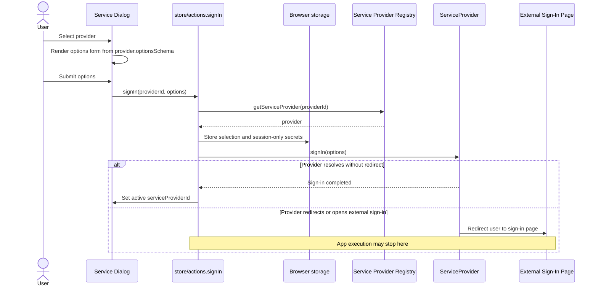
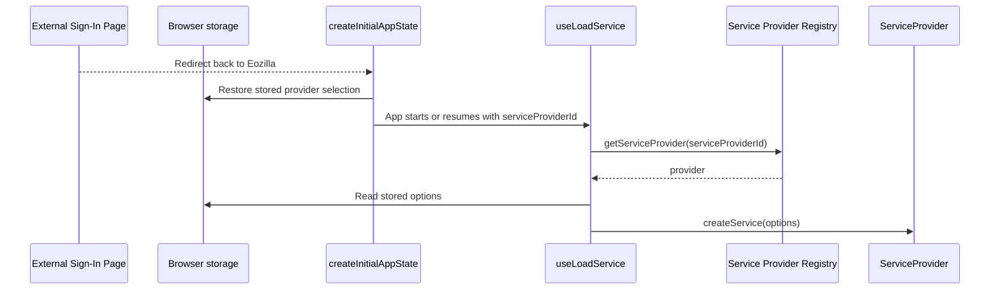
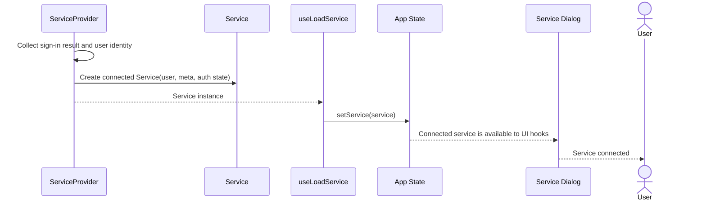

# Service Providers and Services

This document explains how `ServiceProvider` and `Service` work together in
Eozilla, how a user selects a provider, and how sign-in can hand control to an
external web page before the app creates the actual service instance.

## Main Concepts

The service layer is split into two roles:

- `ServiceProvider` describes a selectable service backend and owns the
  sign-in/sign-out lifecycle for that backend.
- `Service` is the connected, user-specific API client used by the rest of the
  application to list processes, execute processes, inspect jobs, and fetch job
  results.

The relevant interfaces live in:

- `src/service/provider.ts`
- `src/service/service.ts`

Provider implementations are registered through `src/service/registry.ts`.
The app registers the built-in providers during startup in `src/main.tsx`.

## ServiceProvider

`ServiceProvider<TOptions>` is the app-facing contract for a backend that can
produce a `Service`.

```ts
interface ServiceProvider<T extends ServiceOptions = NoServiceOptions> {
  id: string;
  meta: ServiceProviderMeta;
  optionsSchema?: ServiceOptionsSchema<T>;
  signIn(options: ServiceOptionsInput<T>): Promise<void>;
  signOut(): Promise<void>;
  createService(options: ServiceOptionsInput<T>): Promise<Service>;
}
```

### `id`

The stable provider identifier. It is stored in local storage as part of the
user's provider selection and is later used to look the provider up again in the
registry.

### `meta`

Display metadata for the service dialog. `meta.title`, `meta.description`,
`meta.type`, `meta.disabled`, and `meta.hidden` decide how the provider appears
in the provider list.

### `optionsSchema`

An optional schema describing configuration values the user must enter before
sign-in. The service dialog converts this schema into a form and passes the
normalized values to `signIn()` and later to `createService()`.

Examples are API URL, token header name, token value, or OAuth2/OIDC
configuration required by a provider. Fields can use `x-ui-visible` to be
shown only when they apply to the selected authentication method, and
`x-ui-required` to reject an incomplete configuration before sign-in starts.

## Custom Service Authentication

The built-in Custom Service provider connects to an arbitrary API URL. Its
configuration offers four authentication choices:

- **None** sends no authentication header.
- **Token** sends the supplied access token as a Bearer token by default, or in
  a user-defined header.
- **Login** posts the supplied username and password to a proprietary login
  endpoint, then sends the returned access token with API requests. The
  endpoint must allow the app's browser origin (CORS).
- **OAuth2** starts browser-based authentication using the OAuth 2.0
  Authorization Code flow with PKCE; choose **OIDC** when the
  authorization server provides OpenID Connect discovery, or **OAuth2** when
  its authorization and token endpoints are configured explicitly.

OAuth2 browser authentication requires a client ID. OIDC additionally requires
the authorization-server URL. Plain OAuth2 requires both the authorization and
token endpoint URLs. The authorization server must be configured to redirect
back to this application and allow the application's browser origin where its
token endpoint is called from the browser.

For OIDC, leaving scopes empty requests `openid profile email`.

The provider sends the obtained access token as a Bearer token with API
requests. If the authorization server supplies a refresh token, the provider
refreshes the access token before it expires. This only authenticates requests
to the configured API; the API must accept the token or provide its own token
exchange mechanism.

## Cuiman-Launched Mode

When Cuiman launches the app, the regular service/provider architecture remains
in use, but the provider represents a same-origin Cuiman proxy rather than the
processing API directly. This mode is intentionally separate from the
stand-alone Custom Service flow described above.

1. Cuiman puts only a short-lived, single-use opaque `launch` code in the app
   URL. It never includes an API URL, headers, tokens, or other service
   configuration in the query string.
2. At startup, the app posts that code to the relative `./_cuiman/launch`
   endpoint. The Cuiman app server consumes the code and creates an HttpOnly
   browser session cookie; the app replaces `launch` in the displayed URL with
   the non-sensitive `cuiman=1` mode marker. This lets a reload retain the
   Cuiman-only provider without retaining a usable launch capability.
   An expired, consumed, or unknown code receives `410 Gone` with the server's
   launch-specific error detail. Other exchange failures retain their own
   status and reason so the app does not misreport them as an expired launch.
3. The app derives both its RemoteState WebSocket URL and its
   `CustomServiceProvider` API URL from the browser-visible location. The API
   URL is the relative `./_cuiman/service/` proxy and uses authentication type
   `none`; the service and provider interfaces therefore remain unchanged for
   UI code.
4. The proxy selects the processing API URL and adds the server-owned
   authentication headers for every request. The browser only sees the
   same-origin proxy URL and cannot read the session cookie or upstream
   credentials.

The app does not offer a sign-out action in Cuiman-launched mode. The Cuiman
client owns the launched session and is responsible for ending it.

The relative paths are essential for remote JupyterLab and JupyterHub
deployments, where Cuiman is reached through `jupyter-server-proxy` under a
path prefix. The derived WebSocket URL retains that same prefix. The provider
selection is kept only for the current browser session, so a previous
stand-alone selection is not overwritten.

This mode requires the Cuiman app server. A permanently deployed stand-alone
SPA continues to use its normal Custom Service configuration and browser-based
authentication flow.

### `signIn(options)`

Called from a user-triggered action after a provider has been selected and its
options have been submitted.

This method is allowed to:

- do nothing and resolve immediately, as the current test/dev/custom providers
  do;
- open a popup;
- redirect the current page to an external sign-in page;
- store provider-specific temporary auth state before redirecting.

The app stores the selected provider id and options before calling
`provider.signIn(options)`. This is intentional: if `signIn()` redirects away
from Eozilla, JavaScript execution stops at that point and the later
`setAppState({ serviceProviderId })` line may never run.

### `signOut()`

Called when the user disconnects the current service. The provider can clear
local credentials, revoke a session, or redirect to a logout page. Just like
`signIn()`, this method may also end app execution by redirecting.

### `createService(options)`

Called after sign-in has completed, including after any external redirects. It
is responsible for collecting the sign-in result, resolving the user identity,
and returning a connected `Service` instance.

For redirect-based providers, this method is where the provider should inspect
provider-owned state, callback parameters, session storage, cookies, or tokens
created by the external sign-in flow. The generic app code only stores the
provider selection and options; provider-specific sign-in information belongs in
the provider implementation.

## Service

`Service` is the connected API client used by UI panels and hooks after a
provider has produced it.

```ts
interface Service {
  providerId: string;
  user: UserIdentity;
  meta: ServiceMetadata;
  getProcesses(): Promise<ProcessList>;
  getProcess(processId: string): Promise<ProcessDescription>;
  executeProcess(processId: string, processRequest: ProcessRequest): Promise<JobInfo>;
  getJobs(): Promise<JobList>;
  getJob(jobId: string): Promise<JobInfo>;
  getJobResults(jobId: string): Promise<JobResults>;
  dismissJob(jobId: string): Promise<void>;
  close(): Promise<void>;
}
```

A service instance is already bound to:

- the provider that created it, via `providerId`;
- the signed-in user, via `user`;
- the service metadata loaded from the backend, via `meta`;
- any headers, tokens, base URLs, or other provider-specific connection state.

Application hooks should depend on `Service`, not on provider-specific auth
details. For example, process and job panels call methods such as
`getProcesses()`, `executeProcess()`, and `getJobResults()` without knowing how
the user authenticated.

## Selection and Sign-In Flow

The full flow is easier to read as a few smaller diagrams:

### Part 1: Provider Selection and Sign-In



### Part 2: App Startup Restores Selection



### Part 3: Service Creation and UI Reconnect



## What Happens in the App

1. The provider list is read from the registry with `getServiceProviders()`.
2. The service dialog shows non-hidden providers from that list.
3. When the user selects a provider, the dialog renders a configuration form
   from `provider.optionsSchema`.
4. When the user submits the form, `store/actions.signIn()`:
   - looks up the provider;
   - stores the provider id and non-secret options under
     `eozilla.serviceProviderSelection` in local storage;
   - stores secret options in browser session storage;
   - calls `provider.signIn(options)`;
   - sets `serviceProviderId` only if control returns to the app.
5. If `provider.signIn()` redirects to another website, app execution can stop
   immediately after the provider call. This is expected behavior.
6. After the external sign-in redirects back to Eozilla, app startup restores
   the provider id from `eozilla.serviceProviderSelection`.
7. `useLoadService()` sees the restored `serviceProviderId`, reads the stored
   options, and calls `provider.createService(options)`.
8. `createService()` resolves the provider-specific sign-in result and user
   identity, loads service metadata if needed, and returns a `Service`.
9. The app stores that `Service` in app state and the rest of the UI uses the
   service methods.

## Provider Implementation Checklist

When adding a new provider:

1. Implement `ServiceProvider<TOptions>`.
2. Choose a stable `id`; changing it breaks persisted selections.
3. Fill `meta` with the user-facing title and optional description.
4. Add `optionsSchema` for values the user must provide before sign-in.
5. In `signIn()`, start the authentication flow. Persist any provider-specific
   temporary state before redirecting.
6. In `createService()`, finish or inspect the authentication result, derive the
   `UserIdentity`, create the concrete `Service`, and return it.
7. In `signOut()`, clear provider-owned credentials or sessions.
8. Register the provider with `registerServiceProvider()` or include it in the
   startup provider list.

## Current Built-In Providers

- `CustomServiceProvider` uses the URL service options and creates a
  `UrlService`. Its current `signIn()` is a no-op; token headers can be supplied
  through options.
- `DevServiceProvider` connects to `http://localhost:8008` with an anonymous
  user. Its `signIn()` and `signOut()` are no-ops.
- `TestServiceProvider` creates an in-memory test service for local development
  and tests.

These providers demonstrate the minimum contract. A real redirect-based
provider should use the same interface but move the auth-specific work into
`signIn()`, `signOut()`, and `createService()`.

## Responsibility Boundary

The application orchestrates provider selection, option collection, persisted
selection restore, and service loading.

The provider owns authentication details. That includes external redirects,
callback parsing, token exchange, session lookup, credential cleanup, and
mapping the authenticated principal to `UserIdentity`.

The service owns backend operations after authentication. UI code should call
the `Service` methods and avoid depending on how the provider authenticated the
user.
